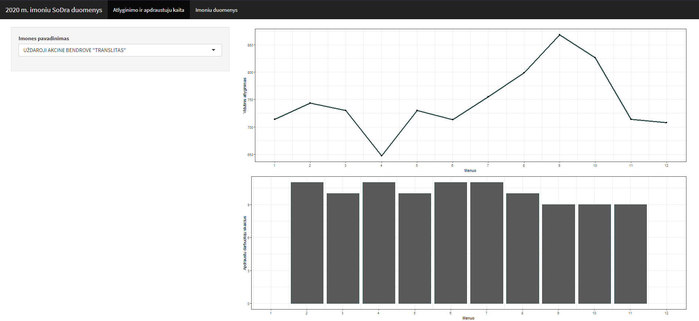
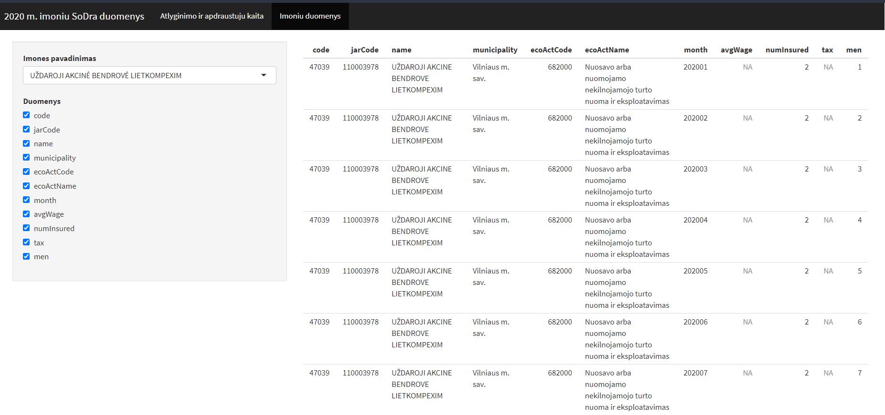

# R Laboratorinis darbas: duomenų vizualizacija

| Variantas | ecoActCode |
|------------- | ------------- |
|3   | 479100	 |

### 1. Užduotis

Atsakymas:

Išvados: Ekonominės veiklos kodo 479100 įmonėse vidutinis atlyginimas yra pasiskirstęs normaliuoju skirstiniu N~(961,518). Vidutinis atlyginimas yra 961 eur, standartinis nuokrypis - 518 eur, mediana - 886 eur.

### 2. Užduotis

Atsakymas:

Išvados: Top 5 įmonės, turinčios didžiausią atlyginimą yra "UŽDAROJI AKCINĖ BENDROVĖ SELECT RINKA", "UŽDAROJI AKCINĖ BENDROVĖ ARPRESA", "UAB HARMONY LIFE", "UAB CGTRADER", "UAB VOLTAS IT".  Įmonių "UAB HARMONY LIFE" ir "UAB CGTRADER" atlyginimų kaita 2020 metų eigoje išliko stabili.
UAB "SELECT RINKA" duomenys stebimi iki rugpjūčio mėnesio, per kurį darbuotojų atlyginimas išaugo maždaug trigubai. Tolesnėje metų eigoje atlyginimo stebinių sodros duomenyse nėra - galbūt įmonė likvidavo savo veiklą.
Likusių dviejų įmonių, "APRESA" ir "VOLTAS IT", atlyginimai 2020 m. laikotarpiu ženkliai nesikeitė, išskyrus gruodžio mėnesį ("APRESA" - ir sausio mėn). Toks pakilimas, galima spėti, atsirado dėl to, kad kai kuriose įmonėse yra praktika paskutinį metų mėnesį mokėti priedus.

### 3. Užduotis

Atsakymas:

Išvados: Lyginant apdraustųjų žmonių skaičių iš praeitoje užduotyje atrinktų penkių įmonių, matoma, kad daugiausia apdraudusių žmonių yra "UAB CGTRADER". Šis skaičius bent dvigubai viršija kitų keturių įmonių apdraustųjų kiekį. "VOLTAS IT" ir "HARMONY LIFE" turi apylygį apdraustų žmonių skaičių. Paskutinėje vietoje yra įmonė "SELECT RINKA", kurios apdraustųjų žmonių skaičius yra maždaug septynis kartus mažesnis už pirmąją vietą užimančią įmonę.

### 4. Užduotis

Shiny R aplikacijos nuotraukos:

